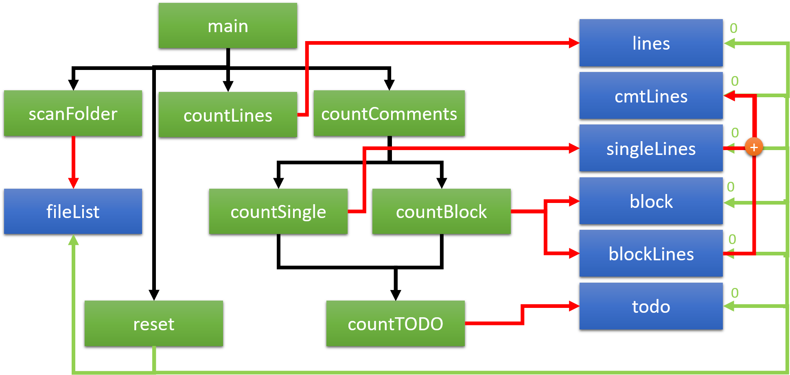

# Comment Counter
Allow users to get a quick summary of lines and comment lines of the program files.

## Major Features
1) When a file is checked in, scan the file to count the total number of lines.
2) Scan the file to identify comments and count the total lines of comments in the file.
3) After identifying the lines of comments, scan to segregate the total number of single line
comments and the total number of multi-line comments.
4) Any line of code that has a trailing comment should be counted both as lines of code
and also a comment line.
5) Finally, from all the comments in the file, identify and count the total number of TODOs.
6) Please note, that the file that is being checked in could be any valid program file. Files
checked in without an extension can be ignored. You can also ignore file names that
start with a ‘.’.


## Usage
- The project is developed by IntelliJ in folder CMTCounter.
- The default path for test code is "testcode".
- The independent compiled file CMTCounter.class is also included.
- The default file type is Java, JavaScript and python. If you want to test other type of files, you could determine your own pattern by following the instruction of program.

## Problem existed
As for trailing comment identification, if a line contains the string that including certain comment pattern in it, the line will be identified as a single comment line wrongly.

For example, in .java file execution:
```java
String s = "\\This is not a comment line."
```
above line will be identified as a comment line because it contains "//" in the line.

To solve this problem, we need to determine that comment pattern is not in the range of quotation. The quality of function still needs to be improved by solving this problem.
